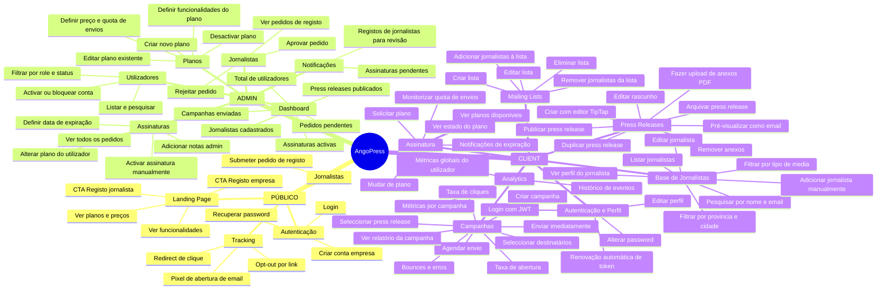
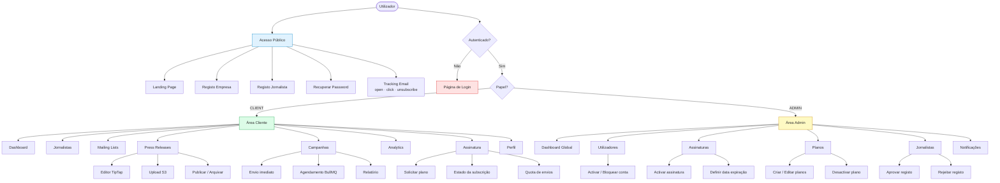
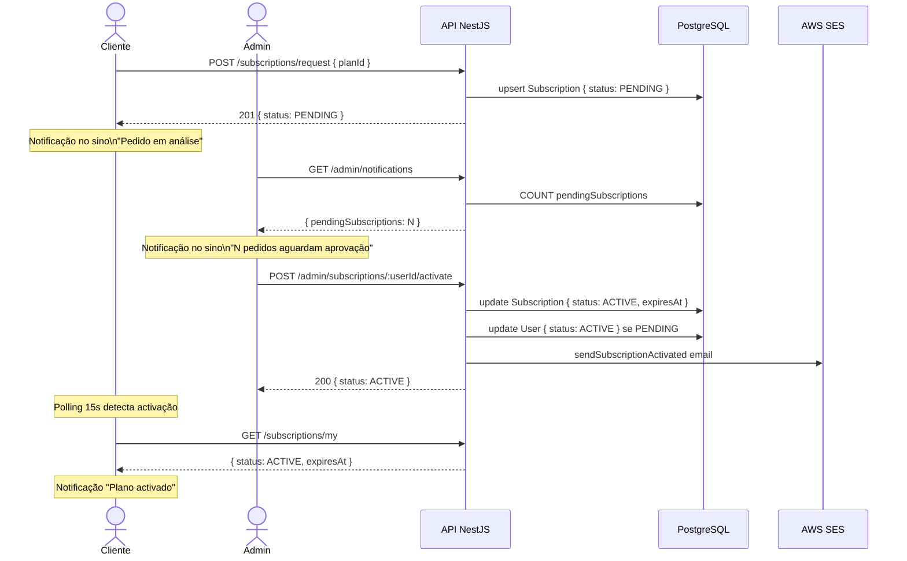
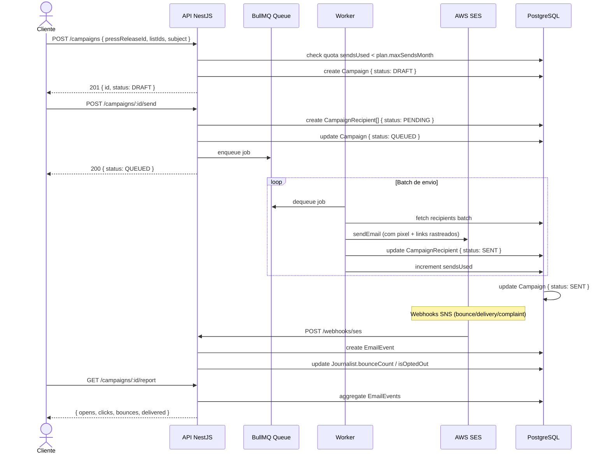
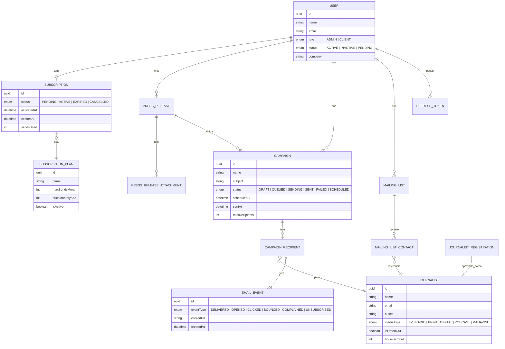

---

## MAPA MENTAL — PAPÉIS E FUNCIONALIDADES



---

## DIAGRAMA DE ACESSO POR PAPEL



---

## FLUXO DE SUBSCRIÇÃO



---

## FLUXO DE CAMPANHA



---

## MODELO DE DADOS SIMPLIFICADO



---

## ARQUITECTURA DE SEGURANÇA

```mermaid
flowchart LR
    REQ([Pedido HTTP]) --> GS[Global Guards]

    GS --> JG{JwtAuthGuard}
    JG -->|@Public decorator| SKIP[Passa directo]
    JG -->|Token inválido| E401[401 Unauthorized]
    JG -->|Token válido| RG{RolesGuard}

    RG -->|@Roles decorator ausente| PASS[Handler]
    RG -->|Role insuficiente| E403[403 Forbidden]
    RG -->|Role satisfeita| PASS

    subgraph Tokens
        AT[Access Token\nJWT · 15 min]
        RT[Refresh Token\nDB · revogável]
        AT -->|expirado| RF[POST /auth/refresh]
        RF -->|RT válido| AT2[Novo Access Token]
        RF -->|RT inválido/revogado| E401B[401 → Logout]
    end

    style E401 fill:#fee2e2,stroke:#dc2626
    style E403 fill:#fef9c3,stroke:#ca8a04
    style PASS fill:#dcfce7,stroke:#16a34a
    style SKIP fill:#e0f2fe,stroke:#0284c7
```